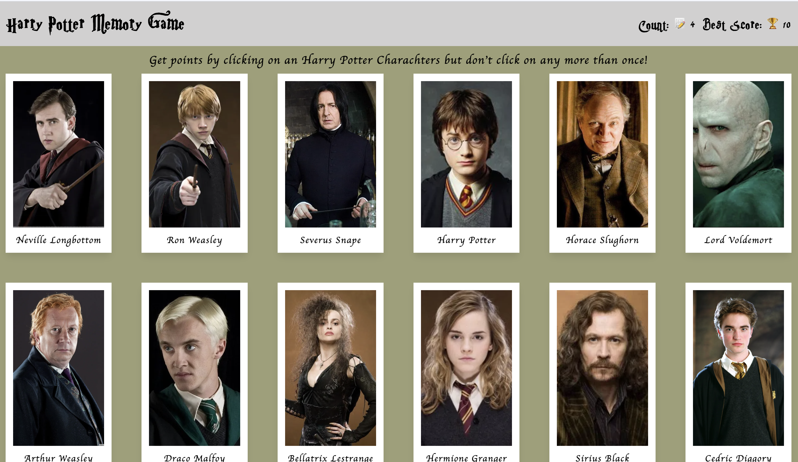

# Harry Potter Memory Game

A fast-paced memory card game built with React where the objective is simple: click every character card only once. Clicking the same card twice resets your current score and starts the round over.

---

## Live Demo

Play the game here:  
[Harry Potter Memory Game](https://harry-potter-memory-game-o0fi1jzv9-shriyashzzzs-projects.vercel.app/)

---

## Preview

> Preview



---

## Features

- Built using reusable React components
- Cards shuffle dynamically after every click
- Memory-based gameplay mechanic
- Tracks both current score and best score
- Uses React Hooks (`useState`, `useEffect`)
- Responsive design for desktop and mobile devices
- Powered by Vite for fast development and builds

---

## Tech Stack

| Technology | Purpose    |
| ---------- | ---------- |
| React      | UI Library |
| Vite       | Build Tool |
| CSS3       | Styling    |
| Vitest     | Testing    |

---

## Getting Started

Follow these instructions to run the project locally.

### Prerequisites

Make sure you have the following installed:

- [Node.js](https://nodejs.org/)
- npm (comes with Node.js)

---

## Installation

### 1. Clone the repository

```bash
git clone https://github.com/Shriyashzzz/harryPotter-memory-game.git
```

### 2. Navigate into the project directory

```bash
cd harryPotter-memory-game
```

### 3. Install dependencies

```bash
npm install
```

### 4. Start the development server

```bash
npm run dev
```

### 5. Open the app in your browser

Vite will provide a local development URL in the terminal:

```txt
http://localhost:5173
```

---

## How to Play

1. Click any Harry Potter character card to begin.
2. After every click, the cards shuffle randomly.
3. Continue selecting cards you haven't clicked before.
4. Clicking the same card twice resets your current score.
5. Try to beat your highest score.

---

## What I Learned

This project helped strengthen my understanding of:

- React component architecture
- State management with Hooks
- Event handling and props
- Importance of keys for dynamic lists that needs to be shown on the UI.
- Conditional rendering
- Responsive UI design
- Managing game state in React

---

## Possible Future Improvements

- Add difficulty levels
- Add animations and sound effects
- Store high score using `localStorage`
- Add a timer or streak system
- Include more character sets
- Add dark mode support

---

## Acknowledgments

- Project followed from [The Odin Project](https://www.theodinproject.com/)
- Character themes and media inspired by the Harry Potter franchise
- Harry Potter Theme by [ankeart] (https://ankeart.gumroad.com)
- Harry Potter API by by (https://hp-api.onrender.com/?ref=freepublicapis.com)

---

## License

This project is for educational and portfolio purposes.
